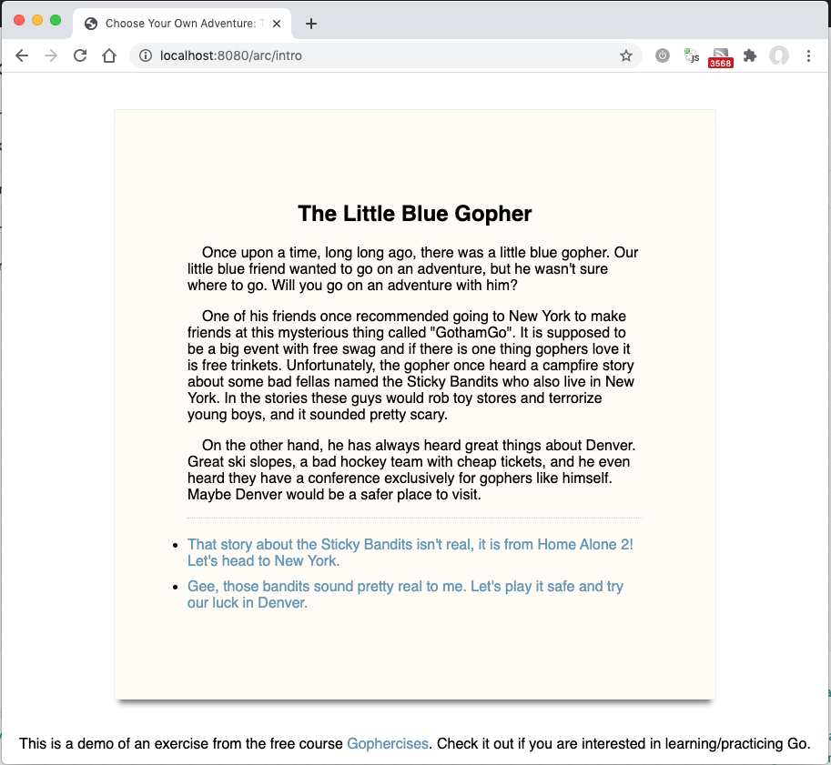
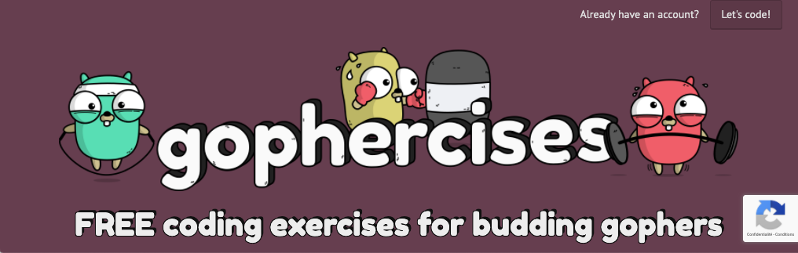

# TwinUI: combined Terminal and Web UIs in Go

This project demonstrates one possible way to provide a full-screen terminal UI
within a traditional web application, thus supporting both a rich user interface
in a browser and a limited but still operational interface using full-screen mode 
in a terminal, as used when communicating over SSH to a server, VM, or container.

| Terminal UI         | Web UI            |
|:-------------------:|:-----------------:|
|  |  |

   
## Acknowledgments

- The Text UI toolkit is [`rivo/tview`]
- The Web routing module is [`gorilla/mux`]
- The web part of the project is taken from Jon Calhoun's "Choose your own adventure"
lesson on his [Gophercises] site.

[Gophercises]: https://courses.calhoun.io/lessons/les_goph_06
[`rivo/tview`]: https://pkg.go.dev/github.com/rivo/tview?tab=overview
[`gorilla/mux`]: http://www.gorillatoolkit.org/pkg/mux

